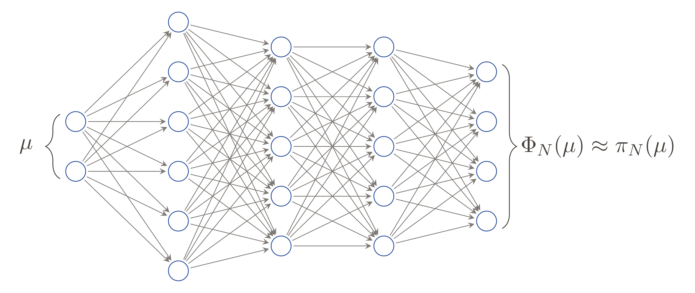
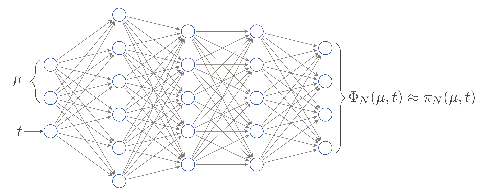
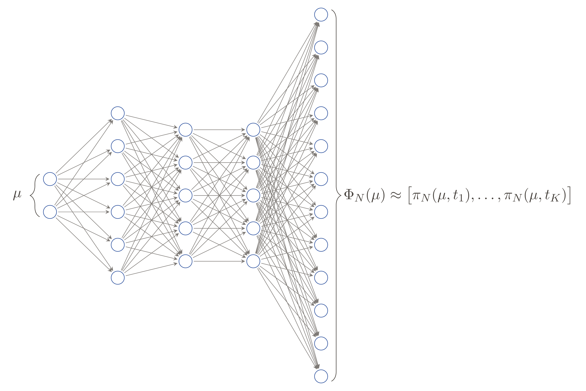
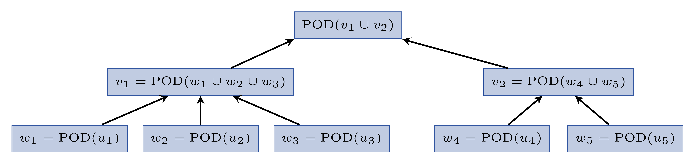
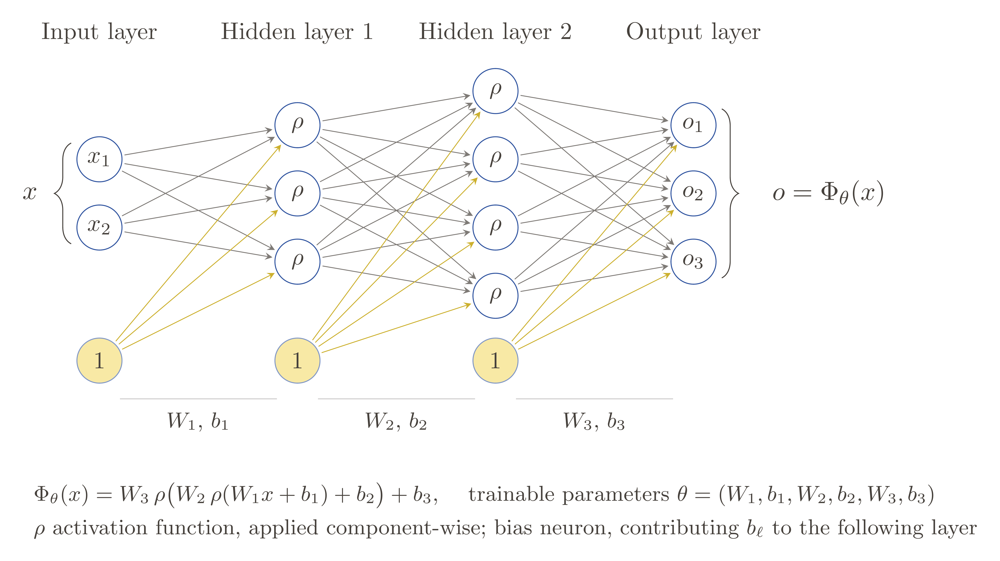

---
jupyter:
  jupytext:
    text_representation:
      extension: .md
      format_name: markdown
      format_version: '1.3'
      jupytext_version: 1.19.5
  kernelspec:
    display_name: Python 3 (ipykernel)
    language: python
    name: python3
---

# Model order reduction for parametric problems with machine learning in pyMOR


## Overview
- Application: Parametrized PDEs (stationary and instationary)
- Theory: Reduced basis methods, proper orthogonal decomposition, supervised machine learning (such as artificial neural networks or kernel methods)
- Practice: Implementation in pyMOR


## A non-intrusive reduced order method using supervised machine learning


### Different scenarios:

1. Given a full-order model $\mu\mapsto u_h(\mu)$, but e.g. no affine decomposition of operators.
2. Given only a set $\{(\mu_i,u_h(\mu_i))\}_{i=1}^n\subset \mathcal{P}\times V_h$ of parameter values with corresponding snapshots.
3. Given an instationary problem that requires solving a linear system in each time step (which can be costly for many time steps).

In all three cases, traditional projection-based model order reduction using a reduced system is difficult or computationally infeasible.


### The approach:

- Compute a reduced space $V_N$ with (orthonormal) basis $\Psi_N$ (for instance via POD, as introduced in the first lecture on reduced basis methods, using only snapshot data)
- Project full-order solution $u_h(\mu)$ onto $V_N$ (orthogonal projection or Galerkin projection):
  $$
  \pi_N \colon \mathcal{P} \to \mathbb{R}^N, \qquad
  \pi_N(\mu) = \Psi_N^\top u_h(\mu)\quad\text{or}\quad \pi_N(\mu)=u_N(\mu)
  $$
- Function $\pi_N$ returns for a parameter $\mu\in\mathcal{P}$ the coefficients
  * of the projection $u_N(\mu)=P_{V_N}(u_h(\mu))$ of $u_h(\mu)$ onto $V_N$ w.r.t. the basis $\Psi_N$, or
  * of the Galerkin projection defined by $a(u_N(\mu), v_N; \mu) = \ell(v_N) \qquad \forall v_N \in V_N$
- Approximate the map $\pi_N$ by a machine learning surrogate $\Phi_N \colon \mathcal{P} \to \mathbb{R}^N$, for instance a neural network:
  
- Learn the machine learning surrogate $\Phi_N$ in a supervised manner from data $\{(\mu_i,\pi_N(\mu_i))\}_{i=1}^n\subset \mathcal{P}\times\mathbb{R}^N$

*Non-intrusive* means that the method (when considering orthogonal projection of training data onto a reduced space) does not require access to the operators - it needs only snapshots with corresponding parameters.

The approach was originally introduced by Hesthaven and Ubbiali in [this paper](https://doi.org/10.1016/j.jcp.2018.02.037).


## A Stationary Example in pyMOR


### Setting up the problem

Example problem:

$$
-\nabla \cdot \big(d(x, \mu) \nabla u(x, \mu) \big) = f(x, \mu), \quad x \in \Omega = (0, 1)^2,
$$

with data functions

$$
\begin{align}
  f((x_1, x_2), \mu) &= 10 \mu + 0.1, \\
  d((x_1, x_2), \mu) &= (1 - x_1) \mu + x_1,
\end{align}
$$

where $\mu \in (0.1, 1)$ denotes the parameter. Further, we apply the Dirichlet boundary conditions

$$
u((x_1, x_2), \mu) = 2 x_1 \mu + 0.5, \quad x = (x_1, x_2) \in \partial\Omega.
$$

The problem further has two outputs, namely the $L_2$-product of the solution with the right-hand side respectively with the Dirichlet boundary data.


This problem is already predefined in `pymor.models.examples`:

```python
from pymor.models.examples import two_dimensional_parametric_diffusion
fom = two_dimensional_parametric_diffusion()

parameter_space = fom.parameters.space((0.1, 1))
```

Let us take a quick look at the FOM:

```python
fom
```

### Setting up the data-driven reductor


We draw training parameters and compute the corresponding snapshots using the FOM (this reductor can also be used when only some training snapshots without FOM are available):

```python
training_parameters = parameter_space.sample_uniformly(100)
training_snapshots = fom.solution_space.empty(reserve=len(training_parameters))
for mu in training_parameters:
    training_snapshots.append(fom.solve(mu))
```

If no reduced basis is available, we can use the `DataDrivenPODReductor` that computes a basis automatically using POD (here, we prescribe a POD tolerance of $10^{-5}$):

```python
from pymor.reductors.data_driven import DataDrivenPODReductor

reductor = DataDrivenPODReductor(training_parameters, training_snapshots, output_functional=fom.output_functional, pod_params={'l2_err': 1e-5})
```

Let's run the `reduce`-method of the `DataDrivenPODReductor`:

```python
rom = reductor.reduce()
```

```python
print(f'Reduced basis size: {len(reductor.reduced_basis)}')
print(f'Regressor: {reductor.regressor}')
```

Using POD, a reduced basis has been computed internally when calling `reduce`. Further, a regressor has been trained on the available data. We will discuss the `VKOGARegressor` (that was used here by default) in more detail below.


### Test of the surrogate

```python
mu = parameter_space.sample_randomly()

U = fom.solve(mu)
U_red = rom.solve(mu)
U_red_recon = reductor.reconstruct(U_red)

fom.visualize((U, U_red_recon, U-U_red_recon),
              legend=(f'Full solution for parameter {mu}',
                      f'Reduced solution for parameter {mu}',
                      f'Difference between solution and approximation'),
              separate_colorbars=True)
```

### Error and runtime comparison


We now test the performance of the data-driven surrogate on a test set (to avoid benefitting from caching we draw different test sets for states and outputs):

```python
test_set_states = parameter_space.sample_randomly(10)
```

State errors and speedups are computed below:

```python
import time
import numpy as np

def compute_average_errors_and_speedups(rom, reductor, test_set):
    U = fom.solution_space.empty(reserve=len(test_set))
    U_red = fom.solution_space.empty(reserve=len(test_set))
    states_speedups = []

    for mu in test_set:
        tic = time.perf_counter()
        U.append(fom.solve(mu))
        time_fom = time.perf_counter() - tic

        tic = time.perf_counter()
        U_red.append(reductor.reconstruct(rom.solve(mu)))
        time_red = time.perf_counter() - tic

        states_speedups.append(time_fom / time_red)

    absolute_errors = (U - U_red).norm()
    relative_errors = (U - U_red).norm() / U.norm()

    return np.average(absolute_errors), np.average(relative_errors), np.average(states_speedups)
```

Let us compute the errors on the test set:

```python
avg_abs_err, avg_rel_err, avg_speedup = compute_average_errors_and_speedups(rom, reductor, test_set_states)

print(f'Average absolute error: {avg_abs_err}')
print(f'Average relative error: {avg_rel_err}')
print(f'Average speedup: {avg_speedup}')
```

We can also look at the errors in the output:

```python
def compute_average_errors_and_speedups_outputs(rom, test_set):
    outputs = []
    outputs_red = []
    outputs_speedups = []

    for mu in test_set:
        tic = time.perf_counter()
        outputs.append(fom.output(mu=mu))
        time_fom = time.perf_counter() - tic
    
        tic = time.perf_counter()
        outputs_red.append(rom.output(mu=mu))
        time_red = time.perf_counter() - tic
    
        outputs_speedups.append(time_fom / time_red)

    outputs = np.squeeze(np.array(outputs))
    outputs_red = np.squeeze(np.array(outputs_red))
    
    absolute_errors = np.abs(outputs - outputs_red)
    relative_errors = absolute_errors / np.abs(outputs)

    return np.average(absolute_errors), np.average(relative_errors), np.average(outputs_speedups)
```

```python
avg_abs_err, avg_rel_err, avg_speedup = compute_average_errors_and_speedups_outputs(rom, test_set_states)

print(f'Average absolute error: {avg_abs_err}')
print(f'Average relative error: {avg_rel_err}')
print(f'Average speedup: {avg_speedup}')
```

## Approximating only the output

Sometimes, one is only actually interested in an output quantity instead of the state. In that case, we can specify `target_quantity='output'` when initializing the `DataDrivenReductor`, which allows to approximate the map from parameter to output directly.

To use this, we first collect all outputs for the training parameters:

```python
outputs = []
for mu in training_parameters:
    outputs.append(fom.output(mu))
outputs = np.array(outputs)
```

Now we set up the `DataDrivenReductor` using output data and call the `reduce`-method:

```python
from pymor.reductors.data_driven import DataDrivenReductor

output_reductor = DataDrivenReductor(training_parameters=training_parameters,
                                     training_snapshots=outputs,
                                     target_quantity='output')

output_rom = output_reductor.reduce()
```

The output errors and speedups can be computed as before:

```python
test_set_outputs = parameter_space.sample_randomly(10)

output_avg_abs_err, output_avg_rel_err, output_avg_speedup = compute_average_errors_and_speedups_outputs(output_rom, test_set_outputs)

print(f'Average absolute error: {output_avg_abs_err}')
print(f'Average relative error: {output_avg_rel_err}')
print(f'Average speedup: {output_avg_speedup}')
```

## Instationary problems

For instationary problems, the general methodology is the same as before, i.e. first a reduced basis is computed from snapshot data and the reduced coefficients are then approximated via machine learning. However, the difference is that here, we need to take the time component into account. There are essentially two different ways how to treat time:

* Random-access-in-time: Treat time as an additional input to the machine learning surrogate. (Introduced by Wang, Hesthaven and Ray in [this paper](https://www.doi.org/10.1016/j.jcp.2019.01.031).)



* Time-vectorized: Predict the entire trajectory of reduced coefficients at once and use only the parameter as input. (Introduced by Haasdonk, Kleikamp, Ohlberger, Schindler and Wenzel in [this paper](https://www.doi.org/10.1137/22M1493318).)



Both approaches are implemented in pyMOR and compared below.


### Hierarchical approximate POD

To compress large datasets, such as solution trajectories of instationary problems with many time steps, a variant of POD is available in pyMOR: the *hierarchical approximate POD* (HAPOD).

The main idea of HAPOD (developed by Himpe, Leibner and Rave in [this paper](https://www.doi.org/10.1137/16M1085413)) is to split the available snapshot collection into subsets, perform PODs for these subsets and combine the resulting vectors (with appropriate scaling) using more PODs, and so on. The splitting and subsequent combination of subsets is often represented as a tree structure, such as the following:



In pyMOR, it is possible to create your own trees and run HAPOD on them. There are also two particularly useful variants implemented directly in pyMOR:

* **Distributed HAPOD** (The snapshot data is distributed into chunks, PODs of each chunk are computed in parallel and finally combined with a single additional POD.)
* **Incremental HAPOD** (The snapshot data is distributed into chunks and these chunks are combined iteratively: The first two chunks are combined using a POD, the resulting modes are then combined with the next chunk using another POD and so on.)

For this example, we show how to use a distributed HAPOD to generate a reduced basis, create training data for the `DataDrivenReductor`, and to use that one compared to `DataDrivenPODReductor`.


### Experiment for a heat equation example

Consider on the spatial domain $\Omega=[0,1]^2$ and the time interval $[0,1]$ the following parabolic equation with a high-conductivity and two parametrized channels ($\mathcal{P}=[1,100]$):
$$
    \partial_t u(\mu) - \nabla (d(\mu)\nabla u(\mu)) = f(t)
$$
with parametric diffusivity
$$
    d(\mu) = 1 + \underbrace{99\cdot\mathbf{1}_{(0.45,0.55)\times(0,0.7)}}_{\text{high-conductivity channel}} + (\mu - 1)\cdot(\underbrace{\mathbf{1}_{(0.35,0.4)\times(0.3,1)}+\mathbf{1}_{(0.6,0.65)\times(0.3,1)}}_{\text{parametrized channels}}),
$$
time-dependent right-hand side
$$
    f(t) = 100\cdot\sin(10\pi t)
$$
and Neumann boundary condition
$$
    \partial_n u(\mu, t, (x,y))=\begin{cases}-1000 & 0.45 < x < 0.55\\0 & \text{else}\end{cases}
$$
at the bottom of the domain ($\Gamma_{\text{bottom}}=[0,1]\times\{0\}$) and homogeneous Dirichlet boundary conditions everywhere else.
The initial condition is set to
$$
    u(\mu, 0) = 10\cdot \mathbf{1}_{(0.45,0.55)\times(0,0.7)}.
$$

This heat equation example is available in [pymor.models.examples](https://docs.pymor.org/main/autoapi/pymor/models/examples/index.html) such that we can use it directly as full order model and define a suitable parameter space:

```python
from pymor.models.examples import heat_equation_example
fom = heat_equation_example()
product = fom.h1_0_semi_product
parameter_space = fom.parameters.space(1, 25)
```

Let us take a quick look at a solution:

```python
fom.visualize(fom.solve(parameter_space.sample_randomly()))
```

We sample 15 training and 10 test parameters:

```python
training_parameters = parameter_space.sample_uniformly(15)
test_parameters = parameter_space.sample_randomly(10)
```

And collect solution trajectories for the training parameters in a big `VectorArray`:

```python
training_snapshots = fom.solution_space.empty(reserve=len(training_parameters))
for mu in training_parameters:
    training_snapshots.append(fom.solve(mu))
```

We now precompute a reduced basis using a **distributed HAPOD** (the arguments of the method are the number of snapshot vector slices, the `VectorArray` of which to compute the HAPOD, the desired $l_2$-mean approximation error, a tuning parameter $\omega$ that balances between performance and approximation quality, and the inner product to use for the PODs):

```python
from pymor.algorithms.hapod import dist_vectorarray_hapod
RB, svals, snap_count = dist_vectorarray_hapod(5, training_snapshots, 1e-4, 0.9, product=product)
```

Let us take a look at the total number of input snapshots and the resulting reduced space dimension:

```python
print(f"Number of snapshots: {snap_count}")
print(f"Dimension of reduced space: {len(RB)}")
```

Now we can prepare the training data for the machine learning by projecting the training snapshots onto the reduced basis:

```python
training_data = training_snapshots.inner(RB, product=product)
print(training_data.shape)
```

We now define again a function for computing errors. Observe here, that we have to do the reconstruction manually using `lincomb` on the reduced basis (the reductor does **not** know about the RB, it only ever sees the projection coefficients):

```python
def compute_errors(rom, reductor):
    speedups = []

    U = fom.solution_space.empty(reserve=len(test_parameters))
    U_red = fom.solution_space.empty(reserve=len(test_parameters))

    for mu in test_parameters:
        tic = time.time()
        u_fom = fom.solve(mu)[1:]
        U.append(u_fom)
        time_fom = time.time() - tic

        tic = time.time()
        u_red = RB.lincomb(rom.solve(mu).to_numpy())[1:]
        U_red.append(u_red)
        time_red = time.time() - tic

        speedups.append(time_fom / time_red)

    relative_errors = (U - U_red).norm2() / U.norm2()

    return relative_errors, speedups
```

We now consider the two versions of handling time: random-access-in-time (by setting `time_vectorized=False`) and time-vectorized (by setting `time_vectorized=True`):

```python
reductor_rait = DataDrivenReductor(training_parameters, training_data, T=fom.T, time_vectorized=False)
rom_rait = reductor_rait.reduce()
rel_errors_rait, speedups_rait = compute_errors(rom_rait, reductor_rait)

reductor_tv = DataDrivenReductor(training_parameters, training_data, T=fom.T, time_vectorized=True)
rom_tv = reductor_tv.reduce()
rel_errors_tv, speedups_tv = compute_errors(rom_tv, reductor_tv)
```

And evaluate the respective errors and speedups:

```python
print('Random-access-in-time:')
print(f'Average relative error: {np.average(rel_errors_rait)}')
print(f'Median of speedup: {np.median(speedups_rait)}')
print()
print('Time-vectorized:')
print(f'Average relative error: {np.average(rel_errors_tv)}')
print(f'Median of speedup: {np.median(speedups_tv)}')
```

We observe that the time-vectorized version is much more accurate here. This observation is discussed in more detail in the exercises.


# Machine learning in pyMOR

In pyMOR, all regressors fulfilling the `Regressor`-interface from [scikit-learn](https://scikit-learn.org) can be used in the `DataDrivenReductor`. Moreover, pyMOR also provides a builtin kernel-based regressor (pure `numpy` implementation) and a neural network regressor (using PyTorch). Both can either be used in the `DataDrivenReductor` but are also applicable independent of model order reduction for approximation of data. In the following, we briefly discuss the basics of the methods and their implementation in pyMOR:


## Neural networks in pyMOR

pyMOR provides a neural network implementation based on [PyTorch](https://pytorch.org/). At the same time, the `NeuralNetworkRegressor` also fulfills the `scikit-learn` interface for regressors. Therefore, the neural networks in pyMOR can be used as replacements for `scikit-learn` regressors.

Fully connected feedforward neural networks are functions that combine affine-linear transformations with component-wise nonlinearities in an alternating fashion. A typical neural network with input $x=[x_1,x_2]$ and output $o=[o_1,o_2,o_3]$ is visualized below:



In pyMOR, an implementation of such a neural network is available as the `FullyConnectedNN` class, which allows to change the number of layers and neurons per layer as well as the activation function. These neural networks can then be used in the `NeuralNetworkRegressor`, whose `fit`-method runs the `multiple_restarts_training`-method implemented in [`pymor.algorithms.ml.nn.train`](https://docs.pymor.org/main/autoapi/pymor/algorithms/ml/nn/train/index.html). There are many tunable parameters also for the training, such as the optimizer, the learning rate, the early stopping scheduler, etc.

The `NeuralNetworkRegressor` can be used in the `DataDrivenReductor` but works also standalone for learning an approximation of (vector-valued) data. We showcase this using the following data:

```python
num_training_points = 100
X = np.linspace(0, 1, num_training_points)[:, None]
eps = 1e-1
F = np.sin(2*np.pi*X) + eps * np.random.normal(size=num_training_points)[:, None]

X_dense = np.linspace(0, 1, 1000)[:, None]
F_dense = np.sin(2*np.pi*X_dense)

import matplotlib.pyplot as plt
plt.scatter(X, F, label='Data points')
plt.plot(X_dense, F_dense, color='red', label='Reference function')
plt.legend()
plt.show()
```

We now create a `NeuralNetworkRegressor` and train it on that data:

```python
from pymor.algorithms.ml.nn import NeuralNetworkRegressor
nn_regressor = NeuralNetworkRegressor()
nn_regressor.fit(X, F)
```

We can finally plot the resulting function:

```python
plt.scatter(X, F, label='Data points')
plt.plot(X_dense, F_dense, color='red', label='Reference function')
plt.plot(X_dense, nn_regressor.predict(X_dense), '--', color='green', label='NN prediction')
plt.legend()
plt.show()
```

## Greedy kernel methods in pyMOR

### Kernel regression

For a given positive-definite kernel $k\colon\mathbb{R}^d\times\mathbb{R}^d\to\mathbb{R}$, kernel functions $\Phi\colon\mathbb{R}^d\to\mathbb{R}$ are of the form
$$
\Phi(x) = \sum\limits_{i=1}^{n} \alpha_i\cdot k(x,x_i)
$$
for $x\in\mathbb{R}^d$ with coefficients $\alpha_1,\ldots,\alpha_n\in\mathbb{R}$ and centers $x_1,\ldots,x_n\in\mathbb{R}^d$.

Given a set of data points $S=\{(\mu_j,h(\mu_j))\in\mathbb{R}^d\times\mathbb{R}: j=1,\ldots,N\}$, kernel methods minimize the mean squared error loss of the kernel surrogate together with a regularization term over the set of all possible kernel function $\Phi$:
$$
\min\limits_{n,(x_i),(\alpha_i)} \frac{1}{N}\sum\limits_{j=1}^{N}\lVert\Phi(\mu_j)-h(\mu_j)\rVert_2^2 + \lambda\lVert\Phi\rVert_{\mathcal{H}_k}^2.
$$
According to a representer theorem, it is sufficient to consider the data points as centers in the kernel expansion. Moreover, the coefficients $\alpha_i$ can be computed explicitly as solutions to a linear system of equations:
$$
(K+\lambda I)\alpha=f,\qquad K=[k(\mu_i,\mu_j)]_{i,j=1}^{N},\qquad f=[h(\mu_i)]_{i=1}^{N}.
$$

### Greedy methods combined with kernel surrogates

To obtain a sparse representation of the kernel surrogate, we apply a greedy algorithm to iteratively select a subset of the centers instead of the entire dataset. The resulting approximant would then be
$$
\Phi(x) = \sum\limits_{i\in\Psi} \tilde{\alpha}_i\cdot k(x,x_i)
$$
for a set $\Psi\subset\{1,\ldots,n\}$ with $|\Psi|\ll n$. Such a sparse version is much more efficient to evaluate and, when selecting the set $\Psi$ carefully, can reach similar accuracy as the full version.

In the Vectorial Kernel Orthogonal Greedy Algorithm (VKOGA), the centers are selected using a greedy algorithm. A selection criterion, such as the deviation of the prediction from the target value, is used to determine which data point to pick next as center. For a fixed set of centers, the surrogate function is determined as described above. The extension of the surrogate can be performed efficiently using a Cholesky factorization of the kernel matrix, which can be updated easily.

The VKOGA algorithm is implemented in pyMOR in the `fit`-method of the `VKOGARegressor`. See [this paper](https://www.doi.org/10.14658/PUPJ-DRNA-2013-Special_Issue-10) by Wirtz and Haasdonk and [this paper](https://www.doi.org/10.1515/9783110498967-009) by Santin and Haasdonk for more details on VKOGA.


### Applying kernel methods to the previous example


We create and train a `VKOGARegressor` similarly to the `NeuralNetworkRegressor` from above:

```python
from pymor.algorithms.ml.vkoga import VKOGARegressor
vkoga_regressor = VKOGARegressor()
vkoga_regressor.fit(X, F)
```

And plot the resulting prediction:

```python
plt.scatter(X, F, label='Data points')
plt.plot(X_dense, F_dense, color='red', label='Reference function')
plt.plot(X_dense, vkoga_regressor.predict(X_dense), '--', color='green', label='VKOGA prediction')
plt.scatter(vkoga_regressor._surrogate._centers[:, 0], F[vkoga_regressor._surrogate._centers_idx], c='red', s=60, label='Selected centers', zorder=5)
plt.legend()
plt.show()
```

# Adaptive model hierarchies

The FOM, the reduced basis ROM (from the lecture on Reduced Basis Methods), and the data-driven surrogate (from this lecture, below referred to as DD-ROM) can be combined in an adaptive model hierarchy in the following way:

Assume we already constructed the reduced models and we are given a prescribed tolerance. Moreover, assume that an a posteriori error estimator is available for the RB-ROM and the DD-ROM (observe here that the residual-based RB-ROM estimator is also applicable to a DD-ROM with the same underlying reduced space).
Then, a new parameter $\mu$ is processed by the hierarchy in the following way:
The cheapest but least accurate model (typically the DD surrogate) is evaluated first for $\mu$. The error estimator is called for the approximate solution and compared to the prescribed tolerance. If the solution is accurate enough, it is returned. If not, the next model (more costly but also more accurate; typically the RB-ROM) is evaluated for the parameter $\mu$ and the error estimator is applied to the approximate solution. Again, if the solution is accurate enough (i.e. the estimated error is below the tolerance), the solution is returned. Otherwise, the hierarchy falls back to the next model, and so on, until the FOM is reached (which is considered to be arbitrarily accurate and does not require error estimation).

The data collected while traversing the hierarchy is used to build and improve the involved models adaptively. The hierarchy can start with empty models and construct the reduced basis using FOM solutions and train the DD surrogate based on RB-ROM solutions.

The adaptive model hierarchy was introduced by Haasdonk, Kleikamp, Ohlberger, Schindler and Wenzel in [this paper](https://doi.org/10.1137/22M1493318).


### Visualization of the model hierarchy

The model hierarchy with three models (FOM, RB-ROM, DD-ROM) is shown in the following interactive figure, visualizing how a parameter $\mu$ is passed through the hierarchy:

```python
import ipywidgets as widgets

frames = [open(f'figures/model_hierarchy_stage{k}.png', 'rb').read() for k in range(1, 6)]

image = widgets.Image(value=frames[0], format='png',
                      layout=widgets.Layout(width='100%', max_width='950px'))
back = widgets.Button(description='◀ Back', layout=widgets.Layout(width='95px'))
fwd = widgets.Button(description='Next ▶', layout=widgets.Layout(width='95px'))
label = widgets.Label()
step = 0

def render():
    image.value = frames[step]
    label.value = f'Step {step + 1} / {len(frames)}'
    back.disabled = step == 0
    fwd.disabled = step == len(frames) - 1

def move(delta):
    def handler(_):
        global step
        step = min(max(step + delta, 0), len(frames) - 1)
        render()
    return handler

back.on_click(move(-1))
fwd.on_click(move(+1))
render()
widgets.VBox([widgets.HBox([back, fwd, label]), image])
```

### The model hierarchy in practice

In this example, we consider again the elliptic problem from the beginning.

```python
fom = two_dimensional_parametric_diffusion()
parameter_space = fom.parameters.space((0.1, 1))
```

We set up a factory for the RB reductor

```python
from pymor.reductors.coercive import CoerciveRBReductor
from pymor.parameters.functionals import ProjectionParameterFunctional
rb_reductor_factory = lambda model: CoerciveRBReductor(model, coercivity_estimator=ProjectionParameterFunctional('mu'))
```

and another factory for the data-driven reductor:

```python
from pymor.algorithms.ml.vkoga import GaussianKernel
kernel = GaussianKernel(length_scale=1.0)
regressor_parameters = {'kernel': kernel, 'criterion': 'fp', 'max_centers': 30, 'tol': 1e-6, 'reg': 1e-12}
dd_reductor_parameters = {'regressor': lambda: VKOGARegressor(**regressor_parameters)}

from pymor.reductors.data_driven import AdaptiveDataDrivenReductor
dd_reductor_factory = lambda model: AdaptiveDataDrivenReductor(dd_reductor_parameters, fom=model)
```

In order to be able to perform the adaptation (extension of the reduced basis requires an additional component in the data-driven reductor) we use the `AdaptiveDataDrivenReductor` which collects multiple `DataDrivenReductors` corresponding to different extension steps.

We can now initialize the hierarchy for a predefined tolerance `tol`:

```python
tol = 5e-3

from pymor.models.hierarchy import ModelHierarchy
hierarchy = ModelHierarchy(fom, [rb_reductor_factory, dd_reductor_factory], tol)
```

The hierarchy does not require calling `reduce`, but we can simply use the `compute`-, `solve`- or `output`-methods of the model (in particular, the `ModelHierarchy` **is** a `Model`!). The `reduce`-method of the reductors in the hierarchy are called automatically when required.

```python
parameters = parameter_space.sample_randomly(100)
model_labels = ['FOM', 'RB', 'DD']

timings_red = []
used_models = []
estimated_errors = []
for mu in parameters:
    tic = time.perf_counter()
    data = hierarchy.compute(solution=True, solution_error_estimate=True, mu=mu)
    timings_red.append(time.perf_counter() - tic)
    used_models.append(model_labels[data['used_model']])
    estimated_errors.append(np.max(data['solution_error_estimate']))

timings_red = np.array(timings_red)
estimated_errors = np.array(estimated_errors)
```

We summarize the result using the following plot, which presents model usage of the three models in the hierarchy, the runtimes and the estimated errors:

```python
import matplotlib.pyplot as plt

model_colors = {'FOM': 'C0', 'RB': 'C1', 'DD': 'C2'}
fig, axes = plt.subplots(1, 3, figsize=(15, 4))

# Model usage counts
models = ('FOM', 'RB', 'DD')
counts = [used_models.count(m) for m in models]
axes[0].bar(models, counts, color=[model_colors[m] for m in models])
axes[0].set_ylabel('count')
axes[0].set_title('Model usage')

# Runtime box plots
timing_data = []
labels = []
colors = []
for model in models:
    idx = [i for i, m in enumerate(used_models) if m == model]
    if idx:
        timing_data.append(timings_red[idx])
        labels.append(model)
        colors.append(model_colors[model])
bplot = axes[1].boxplot(timing_data, patch_artist=True)
axes[1].set_xticklabels(labels)
for patch, color in zip(bplot['boxes'], colors, strict=True):
    patch.set_facecolor(color)
    patch.set_alpha(0.7)
axes[1].set_yscale('log')
axes[1].set_ylabel('time [s]')
axes[1].set_title('Runtimes')

# Estimated errors
for model, marker in (('DD', '*'), ('RB', '.')):
    idx = [i for i, m in enumerate(used_models) if m == model]
    if idx:
        axes[2].plot(idx, estimated_errors[idx], marker,
                     color=model_colors[model], label=model)
axes[2].set_xlabel('parameter index')
axes[2].set_ylabel('error estimate')
axes[2].semilogy()
axes[2].legend()
axes[2].set_title('Estimated errors')

fig.tight_layout()
```

# Summary

- pyMOR provides highly customizable training routines for *neural networks* and *kernel methods* with various options and parameters to tune
- Implementation respects abstract interfaces, i.e. the reductors can be directly applied to models/solutions originating from external solvers (see for instance https://github.com/pymor/pymor/blob/main/src/pymordemos/neural_networks_instationary.py for an example of Navier-Stokes equations using the FEniCS bindings in pyMOR)
- Applicable to stationary and instationary problems
- Combination of different surrogate models via adaptive model hierarchies possible
